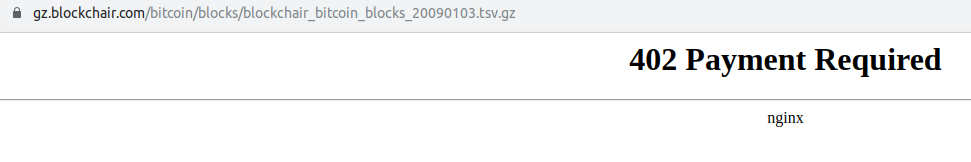

# bitcoin_analysis
Analytics on BTC price and other metrics.

# Data
Uses data from Bitfinex, collected with the [bitfinex-ohlc-import](https://github.com/nateGeorge/bitfinex_ohlc_import) repo.

# Analysis

## Mayer multiple
Trace Mayer's name has been used in the Mayer Multiple.  This is just the ratio of current price to a 200-day moving average of the price.  Trace says you should buy some when it's low (e.g. under 1) and sell some when high (e.g. over 3).  The `mayer_multiple.py` file looks into the mayer multiple, and where it currently is.

## Prophet modeling
This uses the fbprophet model from Facebook.  This decomposes the trend into a long-term piecewise linear trend, as well as daily and monthly trends.  Burger first popularised this model with his price predictions.  `burgers_code.py` is a recreation of his work from his source code and data.  I fixed a few small things along the way, and also added the future price calculation.

Then I went on to collect the data he did in real-time.  Burger's source of blockchair no longer allows exporting to csvs...figured they would monetize that data eventually.  Hilariously, when you try to download their data dumps, it goes to a "402: Payment Required" error.

Looks like for now, we can use btc.com for the data export: https://btc.com/stats/diff (they also have an [API](https://btc.com/api-doc)).